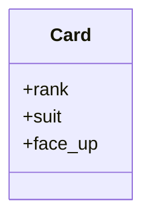
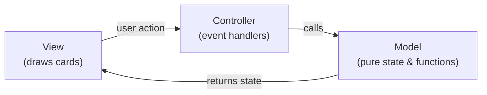
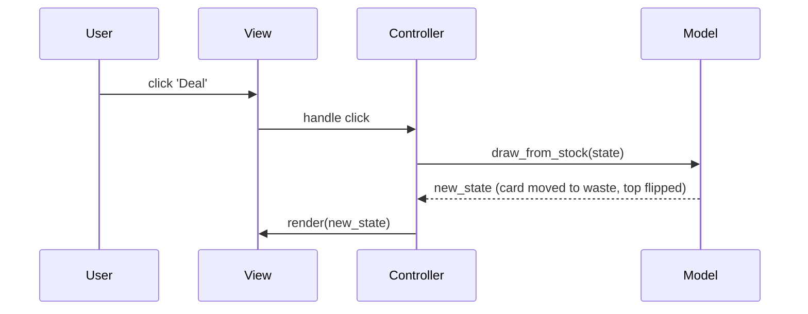

# Quick Reference — Card DS, MVC, and Code Sketches

## Card data structure
- Representation: `(rank, suit)` or `(rank, suit, face_up)`.
- Attributes:
  - `rank` (A,2,...,K)
  - `suit` (S,H,D,C)
  - `face_up` (True/False)

### Helpers (model)
```python
def card_str(card):
    rank, suit = card[0], card[1]
    return f"{rank} of {suit}"

def is_red(card):
    return card[1] in ('H','D','♥','♦')

def flip(card):
    rank, suit, face_up = card
    return (rank, suit, not face_up)
```

## Controller sketch
```python
def on_card_click(state, pile_index):
    new_state = flip_top_card_in_pile(state, pile_index)
    ui.render(new_state)
    return new_state
```

## Move validation (sketch)
```python
def can_place_on_tableau(card_from, card_to):
    if not card_to:
        return card_from[0] == 'K'
    return is_red(card_from) != is_red(card_to) and rank_value(card_from) + 1 == rank_value(card_to)
```

## Inline diagrams (Mermaid)

Card structure:



MVC flow:



Card state flow (user click -> model -> view):


